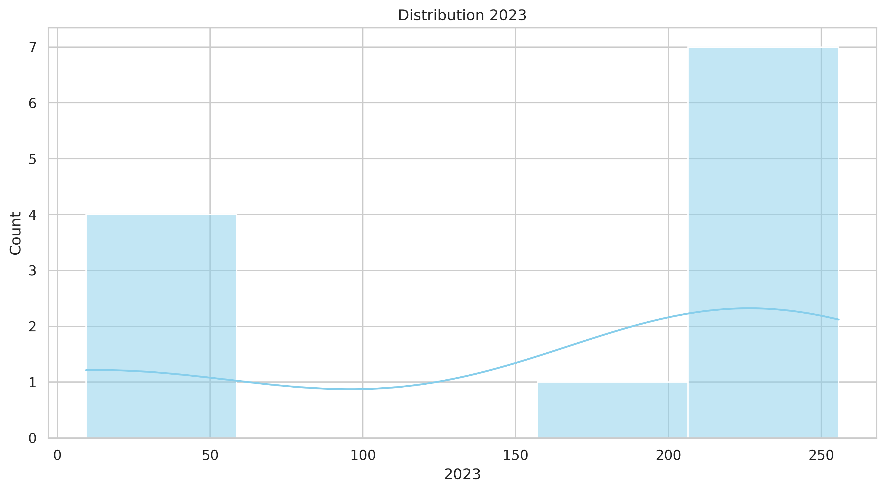
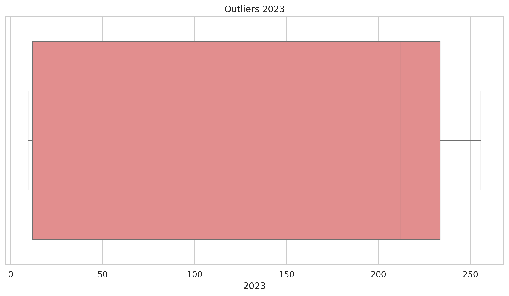
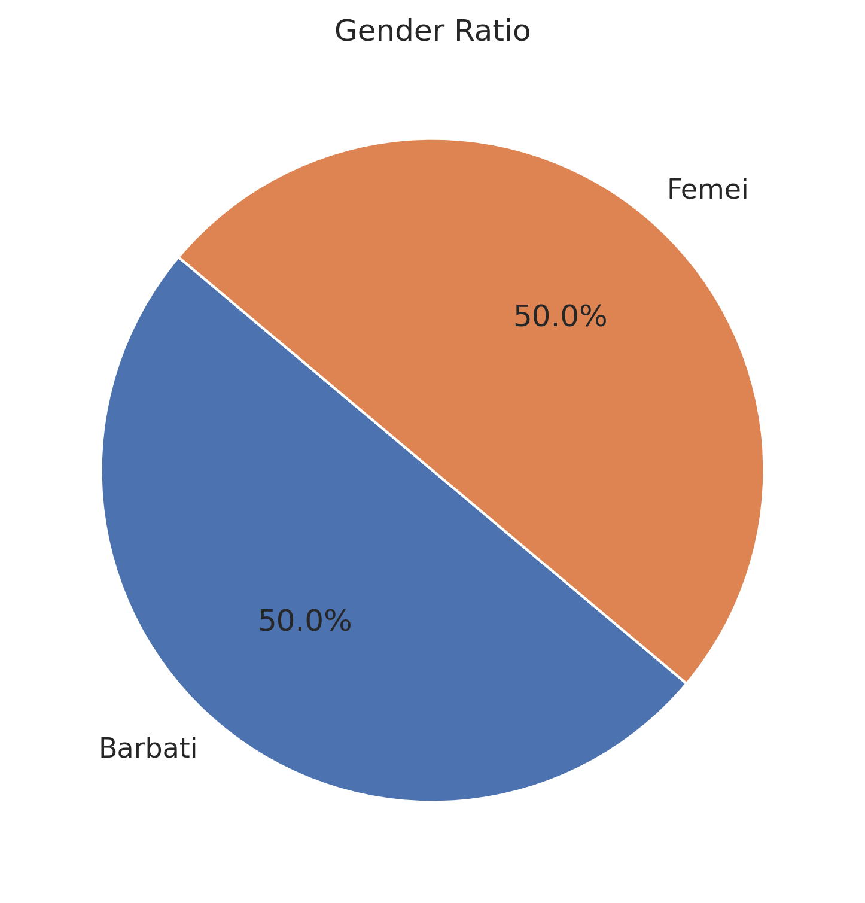
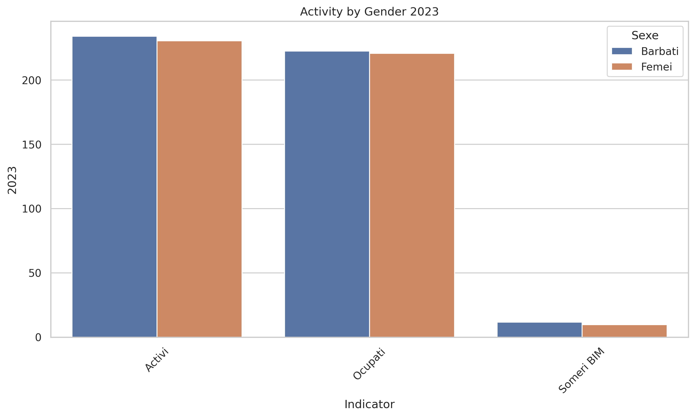
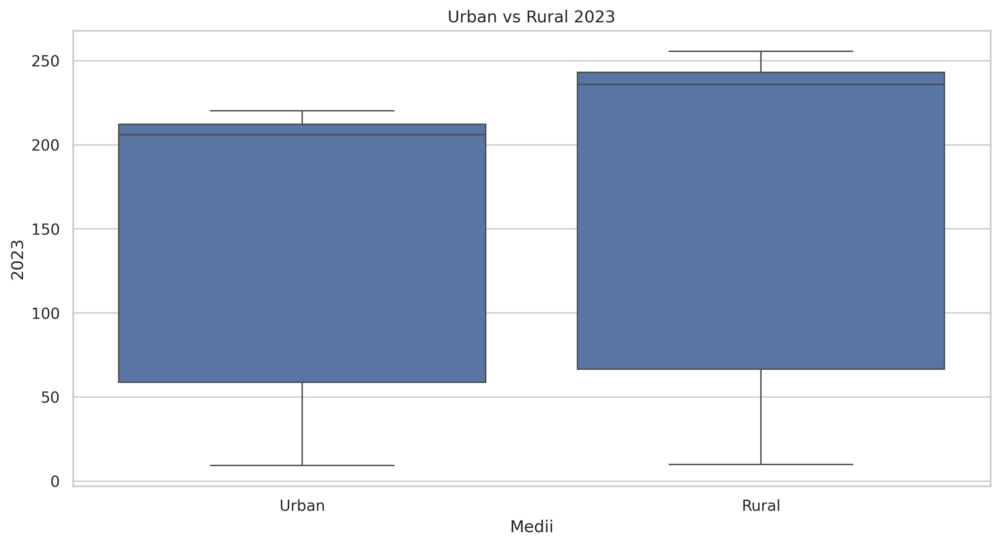
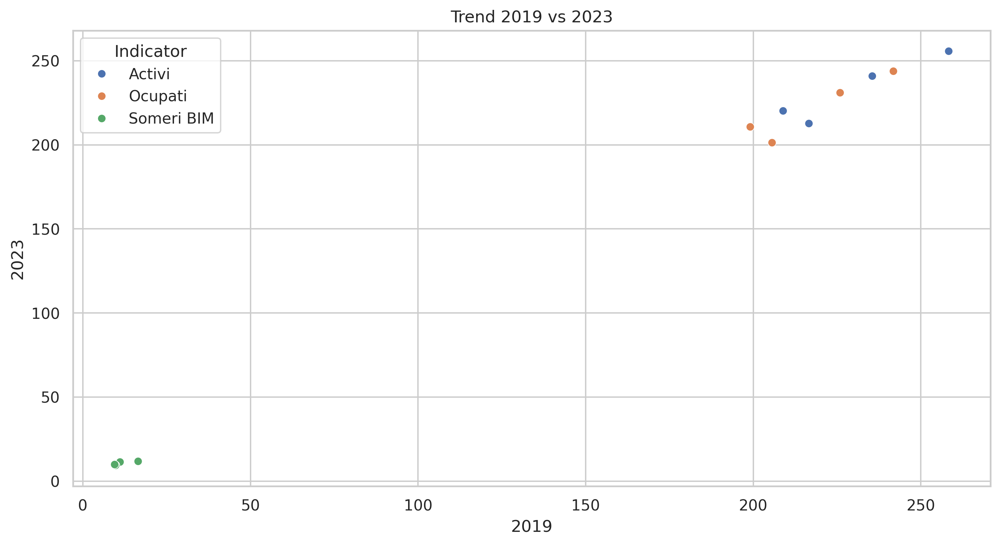
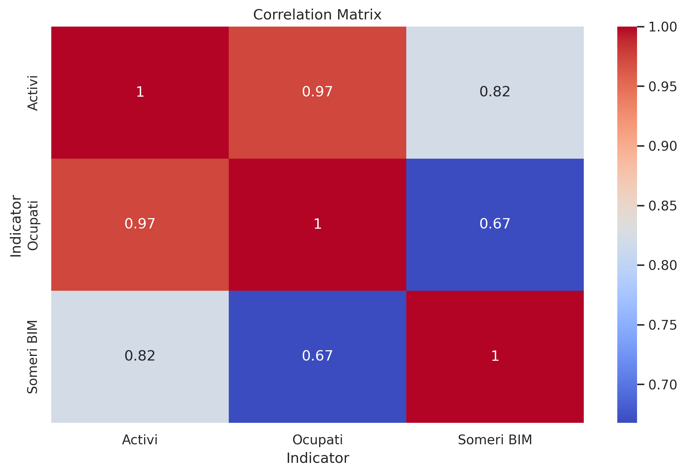

# Moldova Statistics EDA

Exploratory Data Analysis of socio-economic indicators in Moldova (2019–2024) using Python.

## Project Structure

data/raw – original dataset from statistica.gov.md  
data/processed – cleaned dataset  
notebooks – Jupyter/Colab notebook with analysis  
results – generated tables and visualizations  

## Technologies

Python  
Pandas  
NumPy  
Matplotlib  
Seaborn  

## Example Visualizations

### Distribution of Indicator Values (2023)

### Outlier Detection (Boxplot)

### Gender Ratio

### Activity by Indicator and Gender

### Urban vs Rural Comparison

### Scatter Trend Between Years

### Correlation Between Years

